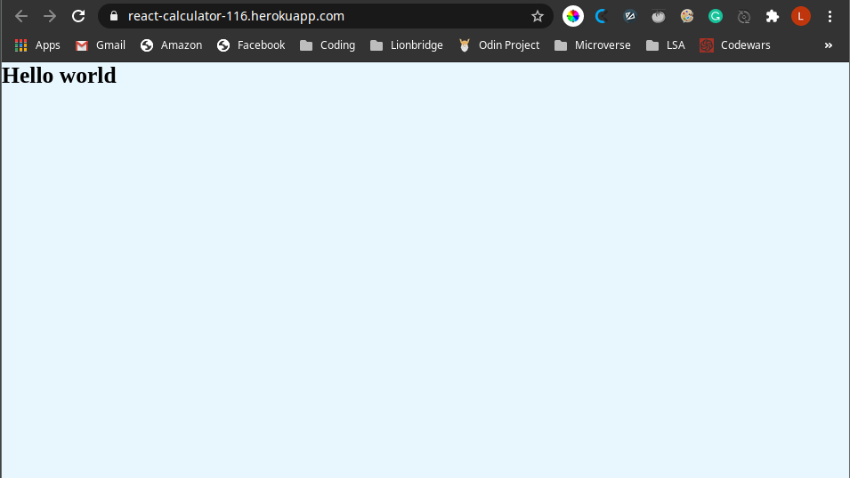

# React Calculator Milestone 1

[![Contributors][contributors-shield]][contributors-url]
[![Forks][forks-shield]][forks-url]
[![Stargazers][stars-shield]][stars-url]
[![Issues][issues-shield]][issues-url]

> KThis is the first milestone in the React Calculator project. On this milestone, I was able to create the basic template for the project. I installed all the required dependencies and created the necessary files for linting. This milestone asked us to deploy our project to Heroku as well, to make sure everything is ready.



> Besides the basic project structure, we had to delete all the files that were not necessary for the development of the project, so now the project is only displaying a "Hello world" message..

## Live Version

[React Calculator](https://react-calculator-116.herokuapp.com/)

## Built With

### Developing tools

- React
- JavaScript
- ESlint
- Stylelint

### Deployment

- Heroku

## Getting Started

To get started with the app, please follow these steps:

- Navigate to the folder where you would like to save the app.

- Open your terminal by right-clicking, and opening the command line of your choice.

- Clone the repo by typing:

```
$ git clone git@github.com:lmaldonadoch/react-calculator.git
```

- Access the newly created folder by typing:

```
$ cd react-calculator
```

- Install the necessary dependencies:

```
npm install
```

## Available Scripts

In the project directory, you can run:

### `npm start`

Runs the app in the development mode.<br />
Open [http://localhost:3000](http://localhost:3000) to view it in the browser.

The page will reload if you make edits.<br />
You will also see any lint errors in the console.

### `npm test`

Launches the test runner in the interactive watch mode.<br />
See the section about [running tests](https://facebook.github.io/create-react-app/docs/running-tests) for more information.

### `npm build`

Builds the app for production to the `build` folder.<br />
It correctly bundles React in production mode and optimizes the build for the best performance.

The build is minified and the filenames include the hashes.<br />
Your app is ready to be deployed!

See the section about [deployment](https://facebook.github.io/create-react-app/docs/deployment) for more information.

### `npm eject`

**Note: this is a one-way operation. Once you `eject`, you can’t go back!**

If you aren’t satisfied with the build tool and configuration choices, you can `eject` at any time. This command will remove the single build dependency from your project.

Instead, it will copy all the configuration files and the transitive dependencies (webpack, Babel, ESLint, etc) right into your project so you have full control over them. All of the commands except `eject` will still work, but they will point to the copied scripts so you can tweak them. At this point you’re on your own.

You don’t have to ever use `eject`. The curated feature set is suitable for small and middle deployments, and you shouldn’t feel obligated to use this feature. However we understand that this tool wouldn’t be useful if you couldn’t customize it when you are ready for it.

### Prerequisites

- Node. If you do not have Node installed in your local machine, please refer to the [Official Documentation](https://nodejs.org/en/download/)
- React. If you do not have React installed in your local machine, please refer to [Official Documentation](https://reactjs.org/)
- Basic command line knowledge.

## Author

👤 **Luis Angel Maldonado**

- Github: [@lmaldonadoch](https://github.com/lmaldonadoch)
- Twitter: [@LuisAngelMCh](https://twitter.com/LuisAngelMCh)
- LinkedIn: [lmaldonadoch](https://www.linkedin.com/in/lmaldonadoch)

## Future Upgrades

- Create components
- Style the interface
- Create calculation functionality
- Create event handlers

## 🤝 Contributing

Feel free to check the [issues page](https://github.com/lmaldonadoch/react-calculator/issues).

## Show your support

Give a ⭐️ if you like this project!

<!-- MARKDOWN LINKS & IMAGES -->

[contributors-shield]: https://img.shields.io/github/contributors/lmaldonadoch/react-calculator.svg?style=flat-square
[contributors-url]: https://github.com/lmaldonadoch/react-calculator/graphs/contributors
[forks-shield]: https://img.shields.io/github/forks/lmaldonadoch/react-calculator.svg?style=flat-square
[forks-url]: https://github.com/lmaldonadoch/react-calculator/network/members
[stars-shield]: https://img.shields.io/github/stars/lmaldonadoch/react-calculator.svg?style=flat-square
[stars-url]: https://github.com/lmaldonadoch/react-calculator/stargazers
[issues-shield]: https://img.shields.io/github/issues/lmaldonadoch/react-calculator.svg?style=flat-square
[issues-url]: https://github.com/lmaldonadoch/react-calculator/issues
